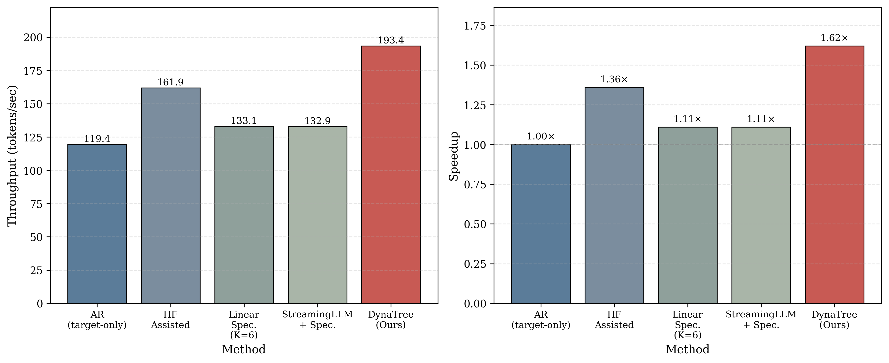

# DynaTree: Confidence-Aware Adaptive Tree Speculative Decoding for Efficient LLM Inference

[](requirements.txt)
[](LICENSE)
[](paper/dynatree.pdf)
[](https://github.com/cny123222/DynaTree)

**Tags**: speculative decoding, tree verification, training-free inference acceleration, greedy decoding (exact)

This repo contains the research code and reproducibility artifacts for **DynaTree**, a **training-free** adaptive tree speculative decoding method for efficient LLM inference.

- **Repository**: `https://github.com/cny123222/DynaTree`
- **Paper**: `paper/dynatree.pdf` (source: `paper/dynatree.tex`)
- **Main results figure**: `figures/main_results_bars.png`
- **Result logs (source of truth)**: `results/` (JSON)

---

## Project overview

### What is DynaTree?
DynaTree is a tree-based speculative decoder that **adapts the draft structure online** (breadth/depth + history-based adjustment) while preserving **greedy-decoding exactness** (same output tokens as the target model under greedy decoding).

### What’s in this repository?
- **DynaTree / speculative decoding code**: `spec_decode/`
- **Paper benchmark scripts**: `papers/`
- **Paper figures + plotting scripts**: `figures/`, `plots/`
- **Logged experiment outputs (JSON)**: `results/`

---

## Quickstart

### 0) Clone

```bash
git clone https://github.com/cny123222/DynaTree.git
cd DynaTree
```

### 1) Install
Recommended (auto-detects CUDA and installs PyTorch accordingly):

```bash
chmod +x setup_environment.sh
bash setup_environment.sh
```

Or manual:

```bash
pip install -r requirements.txt
```

### 2) Check / download models
Most experiments use:
- Target: `EleutherAI/pythia-2.8b`
- Draft: `EleutherAI/pythia-70m`

```bash
python check_models.py
```

Optional helper downloads:

```bash
python download_pythia_2.8b.py
python download_pythia_small.py
```

### 3) Run the main benchmarks (Table 1)

WikiText-2 (\(T=1500\)):

```bash
python papers/benchmark_main_D8B3.py \
  --target-model EleutherAI/pythia-2.8b \
  --draft-model EleutherAI/pythia-70m \
  --max-new-tokens 1500 \
  --num-samples 10 \
  --warmup-runs 2 \
  --max-prompt-length 800 \
  --output results/adaptive/main_D8B3/1500/results.json
```

PG-19 (\(T=1500\)):

```bash
python papers/benchmark_adaptive_pg19.py \
  --target-model EleutherAI/pythia-2.8b \
  --draft-model EleutherAI/pythia-70m \
  --max-new-tokens 1500 \
  --num-samples 10 \
  --warmup-runs 2 \
  --max-prompt-length 1000 \
  --pg19-path data/pg19.parquet \
  --output results/adaptive/pg19/pg19_benchmark_D8B3.json
```

---

## Results (Main table, \(T=1500\))

This is the **main results table** from `paper/dynatree.tex` (throughput in tokens/s, mean±std over prompts; speedup vs AR).

- Linear speculation uses **K=8** on WikiText-2 and **K=5** on PG-19.
- The tuned fixed-tree baseline uses **D=8**, **B=3**, **τ=0.1**.

| Method | WikiText-2 Throughput (tokens/s) | WikiText-2 Speedup | PG-19 Throughput (tokens/s) | PG-19 Speedup |
|---|---:|---:|---:|---:|
| AR | 133.4±0.5 | 1.00× | 114.8±20.6 | 1.00× |
| Linear Spec | 196.1±37.8 | 1.47× | 144.9±28.6 | 1.26× |
| Fixed Tree | 200.7±41.7 | 1.50× | 185.5±33.2 | 1.62× |
| **DynaTree** | **219.5±22.2** | **1.64×** | **194.9±35.6** | **1.70×** |



**Traceability (JSON source files)**:
- WikiText-2: `results/adaptive/main_D8B3/1500/results.json`
- PG-19: `results/adaptive/pg19/pg19_benchmark_D8B3.json`

---

## Paper

### Build the PDF

```bash
cd paper
latexmk -pdf -interaction=nonstopmode -halt-on-error dynatree.tex
```

### Citation

```bibtex
@misc{dynatree2026,
  title        = {DynaTree: Confidence-Aware Adaptive Tree Speculative Decoding for Efficient LLM Inference},
  author       = {Nuoyan Chen and Jiamin Liu and Zhaocheng Li},
  year         = {2026},
  note         = {NeurIPS-style course project paper; see paper/dynatree.pdf in the repository},
}
```

---

## Plotting (paper figures)

- **Committed paper figures**: `figures/`
- **Plot scripts**: `plots/`

Example:

```bash
python plots/plot_main_results.py
```

---

## Repository structure

```text
paper/       LaTeX + compiled PDF
spec_decode/ speculative decoding implementations (tree + linear)
papers/      benchmark scripts (generate JSON under results/)
results/     JSON logs (source of truth for tables/figures)
figures/     paper-ready figures (PNG/PDF)
plots/       plotting utilities
```

---

## Notes / limitations
- Current experiments focus on **batch size = 1** (single-request decoding).
- The paper focuses on **greedy decoding** (exact sequence match to the target model’s greedy output).
- Some scripts load WikiText-2 via ModelScope; if unavailable, they fall back to built-in prompts.

---

## Contact

- **Authors**: Nuoyan Chen, Jiamin Liu, Zhaocheng Li (Shanghai Jiao Tong University)
- **Email**: `cny123222@sjtu.edu.cn`, `logic-1.0@sjtu.edu.cn`, `lzc050419@sjtu.edu.cn`
- For questions/bugs: please open a GitHub issue at `https://github.com/cny123222/DynaTree/issues`.

---

## License
MIT License. See `LICENSE`.
